<h3><code>shesh@github ~ $ ./contributions.sh</code></h3>

  

<h3><code>shesh@github ~ $ whoami</code></h3>

<table>
<tr>
<td width="45%" valign="top" align="center">

</td>
<td width="55%" valign="top" align="center">

</td>
</tr>
</table>

 

<h3><code>shesh@github ~ $ ./projects.sh</code></h3>

<table>
<tr>
<td width="50%" valign="top">

**FreshRoute**

AI-powered perishable value recovery engine. Weighs batch condition, remaining
useful life, market signals and logistics constraints to pick the right
intervention before produce becomes waste.

</td>
<td width="50%" valign="top">

**LLMGuard CI**

Model regression detection for production LLM applications. Catches quality
drift before it ships.

</td>
</tr>
<tr>
<td width="50%" valign="top">

**RAG Engine**

Production-grade hybrid retrieval-augmented generation platform.

</td>
<td width="50%" valign="top">

**SightSpeak**

On-device real-time object detection with audio guidance for visually impaired
users.

</td>
</tr>
<tr>
<td width="50%" valign="top">

**EmpathAI**

Emotion-aware conversational AI with voice interaction.

</td>
<td width="50%" valign="top">

More at 
<a href="https://github.com/sheshakanthra?tab=repositories">github.com/sheshakanthra</a>

</td>
</tr>
</table>

 

<h3><code>shesh@github ~ $ stack</code></h3>

<table>
<tr>
<td><b>AI / ML</b></td>
<td>Python · PyTorch · TensorFlow · NLP · Computer Vision · RAG</td>
</tr>
<tr>
<td><b>Interface</b></td>
<td>React · Next.js · TypeScript</td>
</tr>
<tr>
<td><b>Services</b></td>
<td>FastAPI · Node.js · Express</td>
</tr>
<tr>
<td><b>Data</b></td>
<td>PostgreSQL · MongoDB</td>
</tr>
<tr>
<td><b>Platform</b></td>
<td>Git · GitHub · Vercel · Render</td>
</tr>
</table>

 

<a href="https://shesh-portfolio.vercel.app/">portfolio</a> ·
<a href="https://github.com/sheshakanthra">github</a> ·
<a href="https://www.linkedin.com/in/sheshakanthra/">linkedin</a>

  

<code>BUILDING • LEARNING • SHIPPING</code>

